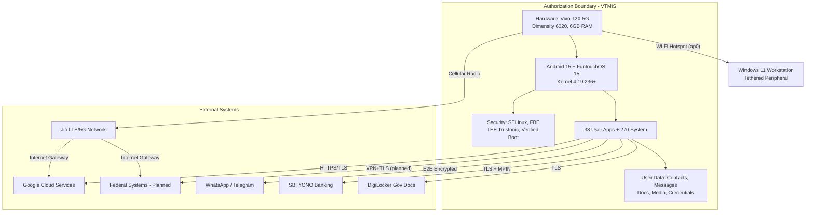

# NETWORK AND DATA FLOW DIAGRAMS

## Vivo T2X 5G Mobile Information System (VTMIS)

---

| **Document Information** | |
|---|---|
| **System Name** | Vivo T2X 5G Mobile Information System (VTMIS) |
| **System Identifier** | VTMIS-2026-001 |
| **Document Version** | 1.0 |
| **Date** | March 9, 2026 |
| **Prepared By** | AAKASH |
| **Regulatory Basis** | NIST SP 800-53 Rev. 5: PL-2, CA-3; FedRAMP SSP Appendix |

---

## 1. NETWORK ARCHITECTURE DIAGRAM

### 1.1 Physical Network Topology

```
┌──────────────────────────────────────────────────────────────────────────────┐
│                          VTMIS NETWORK ARCHITECTURE                          │
│                                                                              │
│  ┌─────────────────────────────────────┐                                     │
│  │        VIVO T2X 5G (V2312)          │                                     │
│  │        Serial: 10BDC81HTA000Z4      │                                     │
│  │                                      │                                     │
│  │  ┌─────────┐  ┌─────────┐  ┌──────┐│                                     │
│  │  │ ccmni0  │  │ ccmni1  │  │ wlan0││                                     │
│  │  │(Primary)│  │(Second) │  │(Wi-Fi││                                     │
│  │  │IPv6+CLAT│  │IPv6+CLAT│  │ DOWN)││                                     │
│  │  └────┬────┘  └────┬────┘  └──────┘│                                     │
│  │       │             │               │                                     │
│  │  ┌────┴─────────────┴────┐  ┌──────┐│    ┌─────────────────────────┐     │
│  │  │   Jio LTE/5G NR      │  │  ap0 ││    │  WINDOWS 11 WORKSTATION │     │
│  │  │   Radio Modem         │  │Hotspot│├───►│  (Tethered Peripheral)  │     │
│  │  └───────────┬───────────┘  │172.18.││    │  IP: 172.18.50.x/24    │     │
│  │              │              │50.78  ││    │  (DHCP from ap0)       │     │
│  │  ┌───────┐  │  ┌─────────┐ └──────┘│    └─────────────────────────┘     │
│  │  │  lo   │  │  │   USB   │         │                                     │
│  │  │127.0. │  │  │ (ADB    │         │                                     │
│  │  │0.1    │  │  │  5037)  │         │                                     │
│  │  └───────┘  │  └────┬────┘         │                                     │
│  └─────────────┼───────┼──────────────┘                                     │
│                │       │                                                     │
│                ▼       │                                                     │
│  ┌─────────────────┐   │    ┌──────────────────────┐                        │
│  │   JIO CELLULAR   │   │    │  USB CONNECTION       │                       │
│  │   NETWORK        │   └───►│  (Assessment only)    │                       │
│  │   ┌───────────┐  │        └──────────┬───────────┘                       │
│  │   │ eNodeB /  │  │                   │                                    │
│  │   │ gNodeB    │  │                   ▼                                    │
│  │   │ (cell     │  │        ┌──────────────────────┐                       │
│  │   │  tower)   │  │        │  WORKSTATION          │                       │
│  │   └─────┬─────┘  │        │  ADB Client           │                       │
│  │         │        │        │  C:\platform-tools     │                       │
│  │   ┌─────▼─────┐  │        └──────────────────────┘                       │
│  │   │ Jio Core  │  │                                                        │
│  │   │ Network   │  │                                                        │
│  │   │ (EPC/5GC) │  │                                                        │
│  │   └─────┬─────┘  │                                                        │
│  └─────────┼────────┘                                                        │
│            │                                                                  │
│            ▼                                                                  │
│  ┌─────────────────┐     ┌──────────────────────────────────────────────┐    │
│  │    INTERNET      │────►│  CLOUD SERVICES                              │   │
│  │                  │     │  ┌──────────┐ ┌──────────┐ ┌──────────────┐ │   │
│  │                  │     │  │ Google   │ │ Meta     │ │ Federal      │ │   │
│  │                  │     │  │ Services │ │(WhatsApp)│ │ Systems      │ │   │
│  │                  │     │  │ (GMS)   │ │          │ │ (Planned)    │ │   │
│  │                  │     │  └──────────┘ └──────────┘ └──────────────┘ │   │
│  │                  │     │  ┌──────────┐ ┌──────────┐ ┌──────────────┐ │   │
│  │                  │     │  │ Telegram │ │ SBI YONO │ │ DigiLocker   │ │   │
│  │                  │     │  │          │ │ (Banking)│ │ (Gov Docs)   │ │   │
│  │                  │     │  └──────────┘ └──────────┘ └──────────────┘ │   │
│  └─────────────────┘     └──────────────────────────────────────────────┘    │
└──────────────────────────────────────────────────────────────────────────────┘
```

### 1.2 Network Interface Detail

| Interface | Type | IP Address | Subnet | Status | MTU | Purpose |
|---|---|---|---|---|---|---|
| ccmni0 | Cellular (Primary) | 2409:4134:*:*/64 + CLAT 192.0.0.4 | /64 (IPv6) | UP | 1500 | Primary internet (Jio SIM 1) |
| ccmni1 | Cellular (Secondary) | 2409:40f4:*:*/64 + CLAT 192.0.0.4 | /64 (IPv6) | UP | 1500 | Secondary cellular |
| ap0 | Wi-Fi Hotspot | 172.18.50.78 | /24 (255.255.255.0) | UP | 1500 | Tethering for workstation |
| wlan0 | Wi-Fi Client | — | — | DOWN | 1500 | Wi-Fi client (not active) |
| lo | Loopback | 127.0.0.1 / ::1 | /8 / /128 | UP | 65536 | Local loopback |
| dummy0 | Virtual | — | — | DOWN | 1500 | Kernel placeholder |

---

## 2. AUTHORIZATION BOUNDARY DIAGRAM

```
┌──────────────────────────────────────────────────────────────────┐
│                    AUTHORIZATION BOUNDARY                         │
│                    (FedRAMP System Boundary)                      │
│                                                                   │
│  ┌────────────────────────────────────────────────────────────┐  │
│  │                 VIVO T2X 5G (V2312)                         │  │
│  │                                                              │  │
│  │  ┌──────────────────────┐  ┌──────────────────────┐        │  │
│  │  │ HARDWARE LAYER       │  │ FIRMWARE LAYER        │        │  │
│  │  │ • Dimensity 6020     │  │ • Bootloader (locked) │        │  │
│  │  │ • 6 GB RAM           │  │ • Verified Boot       │        │  │
│  │  │ • 128 GB Storage     │  │ • Baseband modem      │        │  │
│  │  │ • Biometric sensor   │  │ • TEE (Trustonic)     │        │  │
│  │  │ • Radio transceivers │  │                        │        │  │
│  │  └──────────────────────┘  └──────────────────────┘        │  │
│  │                                                              │  │
│  │  ┌──────────────────────┐  ┌──────────────────────┐        │  │
│  │  │ OS LAYER             │  │ SECURITY LAYER        │        │  │
│  │  │ • Android 15 (API 35)│  │ • SELinux Enforcing   │        │  │
│  │  │ • FuntouchOS 15      │  │ • File-Based Encrypt  │        │  │
│  │  │ • Linux Kernel 4.19  │  │ • Android Keystore    │        │  │
│  │  │ • 270 system packages│  │ • Play Protect        │        │  │
│  │  └──────────────────────┘  └──────────────────────┘        │  │
│  │                                                              │  │
│  │  ┌──────────────────────┐  ┌──────────────────────┐        │  │
│  │  │ APPLICATION LAYER    │  │ DATA LAYER            │        │  │
│  │  │ • 38 user apps       │  │ • Contacts            │        │  │
│  │  │ • System apps        │  │ • Messages / Media    │        │  │
│  │  │ • Google Play Svcs   │  │ • App data            │        │  │
│  │  │ • Jio apps           │  │ • Credentials (TEE)   │        │  │
│  │  └──────────────────────┘  └──────────────────────┘        │  │
│  └────────────────────────────────────────────────────────────┘  │
│                                                                   │
│  ┌ ─ ─ ─ ─ ─ ─ ─ ─ ─ ─ ─ ─ ─ ─ ─ ─ ─ ─ ─ ─ ─ ─ ─ ─ ─ ─ ─ ┐ │
│    BOUNDARY INTERFACES (connection points to external systems)    │
│  │                                                             │ │
│    • Cellular radio ──► Jio Network (EXTERNAL)                   │
│  │ • Wi-Fi hotspot ──► Workstation (PERIPHERAL)                │ │
│    • USB port ──► Workstation ADB (ASSESSMENT ONLY)              │
│  │ • Bluetooth ──► Paired devices (CONTROLLED)                 │ │
│  └ ─ ─ ─ ─ ─ ─ ─ ─ ─ ─ ─ ─ ─ ─ ─ ─ ─ ─ ─ ─ ─ ─ ─ ─ ─ ─ ─ ┘ │
└──────────────────────────────────────────────────────────────────┘

EXTERNAL SYSTEMS (outside boundary):
┌──────────────┐ ┌──────────────┐ ┌──────────────┐ ┌──────────────┐
│ Jio Network  │ │ Google Cloud │ │ Federal Sys  │ │ App Services │
│ (Carrier)    │ │ (GMS/Backup) │ │ (Planned)    │ │ (Various)    │
└──────────────┘ └──────────────┘ └──────────────┘ └──────────────┘
```

---

## 3. DATA FLOW DIAGRAMS

### 3.1 Federal Data Access Flow (Planned)

```
┌──────────┐     ┌──────────────┐     ┌──────────┐     ┌──────────────────┐
│ FEDERAL  │     │  INTERNET    │     │  DEVICE  │     │  USER            │
│ SYSTEM   │     │  (Jio/VPN)   │     │  (VTMIS) │     │  (AAKASH)        │
└────┬─────┘     └──────┬───────┘     └────┬─────┘     └────────┬─────────┘
     │                  │                   │                     │
     │  [1] HTTPS Request via VPN Tunnel    │                     │
     │◄─────────────────┼───────────────────┤   [0] User initiates│
     │                  │                   │◄────────────────────┤
     │                  │                   │                     │
     │  [2] TLS Encrypted Response          │                     │
     ├─────────────────►├──────────────────►│   [3] Data displayed│
     │                  │                   ├────────────────────►│
     │                  │                   │                     │
     │                  │    [4] Data processed in encrypted      │
     │                  │         app sandbox (FBE)               │
     │                  │                   │                     │
     │                  │    [5] Session ends, data cleared       │
     │                  │         or securely stored               │
     │                  │                   │                     │
```

**Security Controls Along Data Flow:**

| Hop | From → To | Encryption | Authentication | Monitoring |
|---|---|---|---|---|
| 0 | User → Device | Biometric/PIN | Device unlock + app auth | Local |
| 1 | Device → Internet | VPN tunnel + TLS 1.2+ | VPN cert + Federal auth | VPN logs |
| 2 | Internet → Federal System | TLS 1.2+ (FIPS 140-2 validated) | MFA | Federal SIEM |
| 3 | Device → User | Screen (visual) | Physical presence | — |
| 4 | Internal processing | File-Based Encryption | App sandbox + SELinux | logcat |
| 5 | Storage/disposal | FBE at rest | PIN-derived key | — |

### 3.2 Hotspot Tethering Data Flow

```
┌───────────┐    ┌─────────────┐    ┌──────────┐    ┌───────────┐
│WORKSTATION│    │ VTMIS       │    │ JIO      │    │ INTERNET  │
│(Win 11)   │    │ ap0 Hotspot │    │ NETWORK  │    │ SERVICES  │
└─────┬─────┘    └──────┬──────┘    └────┬─────┘    └─────┬─────┘
      │                 │               │                 │
      │ [1] Wi-Fi Assoc │               │                 │
      │ WPA2/3 + PSK   │               │                 │
      ├────────────────►│               │                 │
      │                 │               │                 │
      │ [2] DHCP Offer  │               │                 │
      │ 172.18.50.x     │               │                 │
      │◄────────────────┤               │                 │
      │                 │               │                 │
      │ [3] Data Request│               │                 │
      │ (e.g., HTTPS)  │               │                 │
      ├────────────────►│ [4] NAT      │                 │
      │                 │ translate    │                 │
      │                 ├──────────────►│ [5] Route      │
      │                 │               ├────────────────►│
      │                 │               │                 │
      │                 │               │ [6] Response   │
      │                 │ [7] NAT      │◄────────────────┤
      │ [8] Forward    │◄──────────────┤                 │
      │◄────────────────┤               │                 │
      │                 │               │                 │
```

**Hotspot Security Controls:**

| Control | Implementation | Status |
|---|---|---|
| Wi-Fi Encryption | WPA2/WPA3 with passphrase | Active |
| Client Limit | Recommended: 1 device | Configurable |
| NAT | Android NAT (iptables) | Active |
| DNS | dnsmasq on port 53 (172.18.50.78) | Active |
| MAC Filtering | Not implemented | Planned |

### 3.3 Personal Communication Data Flow

```
┌──────────┐     ┌──────────┐     ┌──────────┐     ┌──────────────┐
│  USER    │     │  VTMIS   │     │  JIO     │     │  SERVICE     │
│ (AAKASH) │     │  Device  │     │  NETWORK │     │  (WhatsApp/  │
│          │     │          │     │          │     │  Telegram/etc)│
└────┬─────┘     └────┬─────┘     └────┬─────┘     └──────┬───────┘
     │                │                │                    │
     │ [1] Compose    │                │                    │
     │ message        │                │                    │
     ├───────────────►│                │                    │
     │                │ [2] E2E encrypt│                    │
     │                │ (Signal/MTProto│                    │
     │                │ in app)        │                    │
     │                ├───────────────►│                    │
     │                │                ├───────────────────►│
     │                │                │                    │
     │                │                │ [3] Store/route    │
     │                │                │◄───────────────────┤
     │                │ [4] Deliver    │                    │
     │                │◄───────────────┤                    │
     │ [5] Display    │                │                    │
     │ (decrypted)    │                │                    │
     │◄───────────────┤                │                    │
     │                │                │                    │
```

### 3.4 Cloud Backup Data Flow

```
┌──────────┐     ┌──────────────────────────────┐     ┌──────────────┐
│  VTMIS   │     │  DATA CATEGORIES              │     │  GOOGLE      │
│  Device  │     │                                │     │  CLOUD       │
└────┬─────┘     └────────────────┬───────────────┘     └──────┬───────┘
     │                            │                            │
     │  [1] App data + settings ──┤                            │
     │  [2] Contacts            ──┤                            │
     │  [3] SMS/Call logs       ──┤  [4] Encrypted with       │
     │  [4] Wi-Fi passwords    ──┤       Google account key   │
     │  [5] Device settings    ──┼───────────────────────────►│
     │                            │  via TLS 1.2+              │
     │                            │  over Jio cellular         │
     │                            │                            │
     │  Photos/Videos ────────────┼───────────────────────────►│
     │  (Google Photos)           │  Automatic on Wi-Fi/charge │
     │                            │                            │
     │  ◄─── Restore on new device ◄──────────────────────────┤
     │       (after Google sign-in)                            │
```

---

## 4. PORT AND PROTOCOL DIAGRAM

### 4.1 Active Ports and Services

```
                    VTMIS DEVICE PORTS
                    ==================

    LISTENING PORTS:
    ┌─────────────────────────────────────────┐
    │ Port 53 (DNS)                           │
    │ Protocol: UDP/TCP                       │
    │ Binding: 172.18.50.78 (ap0 hotspot)     │
    │ Service: dnsmasq                        │
    │ Purpose: DNS resolution for tethered    │
    │          workstation                     │
    │ Risk: DNS queries visible on hotspot    │
    └─────────────────────────────────────────┘

    OUTBOUND CONNECTIONS (typical):
    ┌─────────────────────────────────────┐
    │ Port 443 (HTTPS)                    │
    │ All app traffic, API calls, updates │
    ├─────────────────────────────────────┤
    │ Port 5228-5230 (GCM/FCM)           │
    │ Google Cloud Messaging / Firebase   │
    ├─────────────────────────────────────┤
    │ Port 993 (IMAPS)                    │
    │ Email retrieval                     │
    ├─────────────────────────────────────┤
    │ Port 5222 (XMPP)                   │
    │ WhatsApp messaging                  │
    ├─────────────────────────────────────┤
    │ Port 443 (HTTPS/WSS)               │
    │ Telegram MTProto                    │
    └─────────────────────────────────────┘

    ASSESSMENT-ONLY PORT:
    ┌─────────────────────────────────────┐
    │ Port 5037 (ADB)                     │
    │ USB only (not network-exposed)      │
    │ Active only when USB Debug enabled  │
    │ MUST be disabled post-assessment    │
    └─────────────────────────────────────┘
```

### 4.2 Port/Protocol/Service Matrix

| Port | Protocol | Direction | Service | Destination | Encryption | Required? |
|---|---|---|---|---|---|---|
| 53 | UDP/TCP | In (hotspot) | DNS (dnsmasq) | ap0 clients | None (local) | Yes (hotspot) |
| 443 | TCP | Out | HTTPS | Multiple cloud services | TLS 1.2+ | Yes |
| 5228-5230 | TCP | Out | GCM/FCM | Google | TLS | Yes |
| 993 | TCP | Out | IMAPS | Email providers | TLS | Optional |
| 5222 | TCP | Out | XMPP | WhatsApp servers | TLS + E2E | Optional |
| 80 | TCP | Out | HTTP | Captive portals, redirects | None | Minimal |
| 5037 | TCP | Local (USB) | ADB | Workstation (via USB) | None (USB) | Assessment only |
| 8443 | TCP | Out | Alt HTTPS | Banking, gov services | TLS | Optional |

---

## 5. ENCRYPTION BOUNDARY DIAGRAM

```
┌─────────────────────────────────────────────────────────────────┐
│                    ENCRYPTION BOUNDARIES                         │
│                                                                  │
│  ┌─────────────────────────────────────────────────────────┐    │
│  │ LAYER 1: HARDWARE (Trustonic TEE)                        │    │
│  │ ┌─────────────────────────────────────────────┐          │    │
│  │ │ • Biometric templates                        │          │    │
│  │ │ • Master encryption keys                     │          │    │
│  │ │ • Android Keystore private keys              │          │    │
│  │ │ • PIN-derived key material                   │          │    │
│  │ │ Isolation: Hardware (ARM TrustZone)          │          │    │
│  │ └─────────────────────────────────────────────┘          │    │
│  └─────────────────────────────────────────────────────────┘    │
│                                                                  │
│  ┌─────────────────────────────────────────────────────────┐    │
│  │ LAYER 2: STORAGE (File-Based Encryption)                 │    │
│  │ ┌─────────────────────────────────────────────┐          │    │
│  │ │ • CE (Credential Encrypted): User data       │          │    │
│  │ │   Unlocked by: User PIN/biometric            │          │    │
│  │ │ • DE (Device Encrypted): Boot-critical data  │          │    │
│  │ │   Available: After boot, before unlock        │          │    │
│  │ │ Algorithm: AES-256-XTS (hardware accelerated)│          │    │
│  │ └─────────────────────────────────────────────┘          │    │
│  └─────────────────────────────────────────────────────────┘    │
│                                                                  │
│  ┌─────────────────────────────────────────────────────────┐    │
│  │ LAYER 3: TRANSPORT (TLS / VPN)                           │    │
│  │ ┌──────────┐ ┌──────────┐ ┌──────────┐ ┌──────────┐    │    │
│  │ │TLS 1.2+  │ │WPA2/WPA3 │ │VPN Tunnel│ │E2E (app) │    │    │
│  │ │(App→Cloud│ │(Hotspot) │ │(planned) │ │(WhatsApp/│    │    │
│  │ │ traffic) │ │          │ │          │ │ Telegram)│    │    │
│  │ └──────────┘ └──────────┘ └──────────┘ └──────────┘    │    │
│  └─────────────────────────────────────────────────────────┘    │
│                                                                  │
│  ┌─────────────────────────────────────────────────────────┐    │
│  │ LAYER 4: RADIO (Cellular Encryption)                     │    │
│  │ ┌──────────────────────────────────────────────┐         │    │
│  │ │ • LTE: 128-EIA/128-EEA (SNOW, AES, ZUC)     │         │    │
│  │ │ • 5G NR: 128-NEA/128-NIA                     │         │    │
│  │ │ • Managed by: Baseband modem + SIM USIM      │         │    │
│  │ └──────────────────────────────────────────────┘         │    │
│  └─────────────────────────────────────────────────────────┘    │
└─────────────────────────────────────────────────────────────────┘
```

---

## 6. SECURITY ZONE DIAGRAM

```
┌─────────────────────────────────────────────────────────────────┐
│                       SECURITY ZONES                             │
│                                                                  │
│  ZONE 1: TRUSTED (Internal to device)                           │
│  ┌─────────────────────────────────────────────────────────┐    │
│  │ • TEE (Trustonic) — highest trust                        │    │
│  │ • Android Kernel (SELinux enforced)                      │    │
│  │ • Verified Boot chain                                     │    │
│  │ • System partition (dm-verity protected)                  │    │
│  └─────────────────────────────────────────────────────────┘    │
│                                                                  │
│  ZONE 2: CONTROLLED (Device user space)                         │
│  ┌─────────────────────────────────────────────────────────┐    │
│  │ • Installed applications (sandboxed)                      │    │
│  │ • User data (File-Based Encrypted)                        │    │
│  │ • App permissions (runtime-gated)                         │    │
│  └─────────────────────────────────────────────────────────┘    │
│                                                                  │
│  ZONE 3: SEMI-TRUSTED (Direct connections)                      │
│  ┌─────────────────────────────────────────────────────────┐    │
│  │ • Wi-Fi Hotspot clients (workstation) — WPA2/3 encrypted │    │
│  │ • USB connection (ADB) — physical access required         │    │
│  │ • Bluetooth paired devices — encrypted link               │    │
│  └─────────────────────────────────────────────────────────┘    │
│                                                                  │
│  ZONE 4: UNTRUSTED (External networks/services)                 │
│  ┌─────────────────────────────────────────────────────────┐    │
│  │ • Jio carrier network — TLS required for all data         │    │
│  │ • Internet — VPN + TLS required for Federal data          │    │
│  │ • Public Wi-Fi — PROHIBITED for Federal data              │    │
│  │ • Third-party cloud services — per ISA agreements         │    │
│  └─────────────────────────────────────────────────────────┘    │
│                                                                  │
│  ZONE TRANSITIONS:                                               │
│  Zone 1 → Zone 2: SELinux policy, permission model              │
│  Zone 2 → Zone 3: Hotspot PSK, USB auth, BT pairing            │
│  Zone 3 → Zone 4: NAT, firewall (iptables), VPN (planned)      │
└─────────────────────────────────────────────────────────────────┘
```

---

## 7. MERMAID DIAGRAM (Machine-Readable)

For tools that support Mermaid rendering:



---

## 8. DIAGRAM REVISION LOG

| Version | Date | Author | Changes |
|---|---|---|---|
| 1.0 | March 9, 2026 | AAKASH | Initial network and data flow diagrams |

---

*END OF NETWORK AND DATA FLOW DIAGRAMS*
